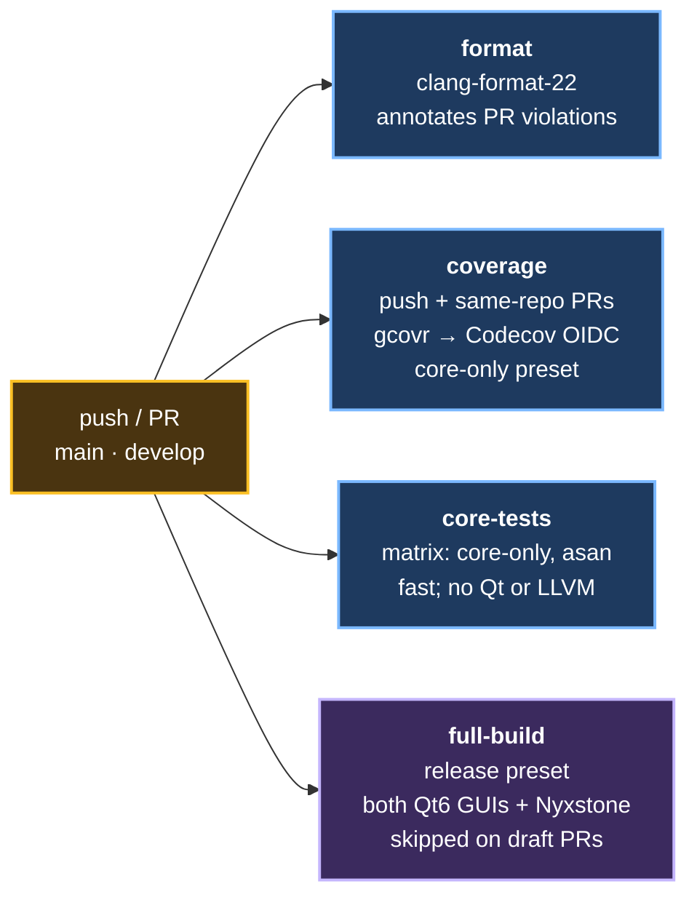

# clearCore — CLAUDE.md

Educational MIPS CPU emulator with pipeline visualization. Three frontends share two core
libraries; a future RV32I backend is in design. This file is the authoritative source of
project conventions for AI-assisted work.

---

IMPORTANT: When applicable, prefer using clion-index MCP tools for code navigation and refactoring.

## Architecture

```
isa/              ISA-agnostic abstract layer (IProcessor, Memory, RegisterFile)
mips/             MIPS-specific backend (IMipsProcessor extends IProcessor, CP0, GDB stub)
nsc_core/         Number-system converter (parse / format / convert)
nsc_ui/           FTXUI terminal UI over nsc_core + mips_core
nsc_qt/           Qt6 Widgets GUI (SimulatorController, docked panels, custom widgets)
nsc_quick/        Qt Quick/QML GUI (QuickSimulator QML bridge, RegisterModel)
qml/ClearCore/    QML source — one URI, one directory, Theme singleton
```

**Layer rules (hard):**

- `mips_core` and `nsc_core` must have zero UI headers. They are pure C++ with no Qt, no FTXUI.
- `nsc_qt` may depend on `mips_core`; `nsc_quick` reuses `nsc_qt::SimulatorController`.
- New ISA backends (e.g. RISC-V) derive from `isa::IProcessor`, not `mips::IMipsProcessor`.
- The `isa/` headers are the only types the TUI render helpers, Qt bridge, and generic tests
  should hold; MIPS-specific types belong only in `mips/` consumers.

---

## Build System

**Generator:** Ninja. **Minimum CMake:** 3.20. **Standard:** C++20 (`EXTENSIONS OFF`).

```bash
cmake --preset debug            # configure
cmake --build --preset debug    # build everything
ctest --preset debug            # unit tests

cmake --preset core-only        # no Qt, no LLVM — fast iteration on core logic
cmake --preset asan             # ASan + UBSan instrumented build
```

`compile_commands.json` is always emitted (`CMAKE_EXPORT_COMPILE_COMMANDS ON`) into
`build/<preset>/`. The repo-root `.clangd` points clangd at `build/debug`, so configure that
preset at least once and clangd resolves includes and indexes the tree; without it every
header reports phantom errors and cross-file navigation returns nothing. IDEs that read the
database directly want `build/debug/compile_commands.json`.

**Key CMake options:**

| Option               | Default | Purpose                                        |
|----------------------|---------|------------------------------------------------|
| `BUILD_QT6_UI`       | ON      | Qt6 Widgets GUI (`clearCore-gui`)              |
| `BUILD_QT6_QUICK_UI` | ON      | Qt Quick GUI (`clearCore-quick`)               |
| `BUILD_NYXSTONE`     | ON      | LLVM assembler/disassembler (needs LLVM 15–20) |
| `ENABLE_SANITIZERS`  | OFF     | ASan + UBSan (use `asan` preset instead)       |
| `BUILD_GDB_STUB`     | ON      | GDB RSP stub (requires POSIX `sys/socket.h`)   |
| `GOLDEN_TESTS`       | ON      | Differential vs MARS reference simulator       |
| `FUZZING_ENGINE`     | —       | ClusterFuzzLite libFuzzer harnesses            |

**Nyxstone LLVM version pinning:** Nyxstone v0.1.8 supports LLVM 15–20 only. If the system
default is newer (LLVM 21+), point it explicitly:

```bash
NYXSTONE_LLVM_PREFIX=/usr/lib64/llvm19 cmake --preset debug
```

**FetchContent dependencies (auto-downloaded, never edit):**

- FTXUI v7.0.0, Microsoft GSL v4.2.0, spdlog v1.14.1, Nyxstone v0.1.8
- Qt GUI extras: QADS 4.5.0 (LGPL shared lib), QHexView v5.1.1

---

## C++20 Conventions

**Standard:** C++20 (`cxx_std_20` on every target). No extensions (`EXTENSIONS OFF`).

### Must do

- `#pragma once` on every header — include guards are banned (migrated in refactor/nsc-header-cleanup).
- `[[nodiscard]]` on all getters and any function whose return value must not be silently discarded.
- `noexcept` on pure accessors that cannot throw (inline register/PC getters, etc.).
- `[[nodiscard]] virtual ... = 0` pattern for pure-virtual accessors in interfaces.
- `final` on every concrete class that must not be subclassed.
- `= default` virtual destructors in abstract base classes.
- Scoped enums (`enum class`) exclusively; no plain `enum`.
- Smart pointers (`std::unique_ptr`, `std::shared_ptr`) for heap ownership; no raw `new`/`delete`.
- `gsl::not_null<T*>` when a pointer parameter is required non-null.
- `std::array` over C arrays; `std::span` / `gsl::span` for non-owning views.
- `static_cast` / `bit_cast` over C-style casts.
- Trailing `_` for private member variables: `pc_`, `regs_`, `mem_`, `cycle_`.
- Compile-time constants as `static constexpr`, not macros.

### Must not do

- `using namespace std` in any header.
- Raw `new` / `delete`.
- C-style casts.
- Mutable global state outside of spdlog tracing infrastructure.
- Mixing exception and error-code patterns; the core uses return-value `StepResult`, not exceptions.

### Naming

| Entity                         | Style         | Example                                        |
|--------------------------------|---------------|------------------------------------------------|
| Types / classes                | `PascalCase`  | `PipelinedCpu`, `StageSnapshot`                |
| Functions / methods (core)     | `snake_case`  | `load_program`, `derive_control`               |
| Member variables               | `snake_case_` | `pc_`, `mem_wb_`                               |
| Constants / `static constexpr` | `kPascalCase` | `kTraceMaxRows`                                |
| Namespaces                     | `snake_case`  | `isa::`, `mips::`, `nsc::qt::`, `nsc::quick::` |
| Macros (minimise)              | `UPPER_SNAKE` | `CLEARCORE_NYXSTONE_ENABLED`                   |

### Namespace layout

```
isa::           IProcessor, StepResult, PipelineState, StageSnapshot, Memory, RegisterFile
mips::          IMipsProcessor, SingleCycleCpu, PipelinedCpu, Control, Cp0, DecodedInstr, …
nsc::           converter / parse / format
nsc::qt::       SimulatorController, SimulatorStatistics, widget classes
nsc::quick::    QuickSimulator, RegisterModel
```

### Comments

Write comments only when the **why** is non-obvious: a hidden hardware constraint, a subtle
pipeline invariant, a workaround for a specific version-pinning issue. The section header
style used in existing files (`// ─── Title ──────`) is the project convention for file-level
and class-level separators.

---

## Qt6 Widgets Conventions (`nsc_qt/`)

- Qt version floor: **6.4** for the Widgets GUI.
- AUTOMOC ON; AUTORCC ON. Do **not** list `moc_*.cpp` or `ui_*.h` in source lists.
- Q_OBJECT macros in `.h` files only (not in `.cpp`).
- Qt method names follow **camelCase** (Qt's own convention): `loadProgram`, `stepCycle`, `isRunning`.
- Signals use **camelCase** noun or verb phrases: `cycleExecuted`, `pipelineStateChanged`, `halted`.
- All `QObject` subclasses pass `QObject* parent = nullptr` as the last constructor parameter.
- `mutable QMutex mutex_` guards shared state accessed from `QTimer` slots.
- Never pass Qt types (`QString`, `QVariant`) into `mips_core` or `nsc_core` — the boundary
  is `SimulatorController`, which converts at the seam.
- Header file for every Qt class that has `Q_OBJECT`, listed in the CMake source list so AUTOMOC
  finds it.
- `KF6::SyntaxHighlighting` is an optional find — check `HAVE_KSYNTAXHIGHLIGHTING` before using.

---

## Qt Quick / QML Conventions (`nsc_quick/`, `qml/ClearCore/`)

- Qt version floor: **6.5** for the Quick GUI.
- `qt_add_executable` + `qt_add_qml_module` — never list `.qml` files in `qt_add_resources`.
- URI: `ClearCore`. QML files live in `qml/ClearCore/`. `RESOURCE_PREFIX /qt/qml`.
- `Theme.qml` is a **singleton** (`pragma Singleton`; `QT_QML_SINGLETON_TYPE TRUE` before
  `qt_add_qml_module`). Every color and spacing value must come from `Theme` — no raw hex,
  no magic pixel values in components.
- Design tokens (all in `Theme.qml`):
    - Spacing: `Theme.s1`=4, `Theme.s2`=8, `Theme.s3`=12, `Theme.s4`=16, `Theme.s5`=24
    - Font sizes: `fontCaption`=12, `fontBody`=15, `fontH2`=17, `fontH1`=19, `fontDisplay`=24
    - Palette: Solarized-derived; semantic roles `interactive`, `accent`, `success`, `warning`,
      `danger`, `violet` — prefer semantic over direct color names.
    - Motion: `Theme.durFast`=120ms, `Theme.durMedium`=220ms; respect `Theme.reducedMotion`.
- `QtQuick.Controls.Basic` is the Controls style — no Material, no Fusion.
- C++ types exposed to QML use `QML_ELEMENT` / `QML_NAMED_ELEMENT`; `Q_PROPERTY` with
  `NOTIFY` signal for every bindable piece of state.
- `Q_INVOKABLE` for imperative actions from QML (`step`, `runPause`, `assembleAndLoad`, etc.).
- `QAbstractListModel` subclasses emit `dataChanged` only for rows that actually changed
  (performance requirement; the pipeline runs at frame rate).
- `qmltyperegistrar` includes moc'd headers by basename — the target's `target_include_directories`
  must include the directory that contains the header, not just `include/`.

---

## Testing

```bash
ctest --preset debug          # all unit tests
ctest --preset asan           # ASan/UBSan (runs core-library tests)
ctest --preset core-only      # TUI + core only, no Qt
```

- MARS golden tests (`tests/golden/`) do differential checking against the MARS 4.5.1 reference
  simulator. Require Java + Python3; silently skipped when missing.
- Qt UI tests run headlessly: `QT_QPA_PLATFORM=offscreen` is set by CMake automatically.
- Fuzz harnesses are ClusterFuzzLite only; not built in normal or CI builds.
- **If you add logic to `mips_core` or `nsc_core`, add a test in `tests/mips/` or `tests/nsc/`.**
- Test executables follow the pattern `clearcore_add_test(name source lib)` — use the helper.

---

## Git Workflow

- **Always branch from `develop`**; PRs target `develop`, not `main`.
- `Closes #N` in a PR body does **not** close the issue: GitHub only auto-closes on a merge to the
  default branch, and PRs here target `develop` while `main` is the default. Close the issue by hand
  when the fix lands on `develop`, or let the release-promotion PR close it.
- Branch naming: `feature/`, `fix/`, `chore/`, `refactor/`, `docs/` prefixes.
- Label PRs so release-drafter categorises them:
  `feature`, `enhancement`, `bug`, `security`, `documentation`, `dependencies`, `ci`.
- **Strict SemVer**: new user-visible capability → `MINOR` bump; bug fix → `PATCH` bump.
  Never bump only PATCH for a feature.
- **Version numbers are automated.** `update-changelog.yml` aligns `CHANGELOG.md`,
  `CITATION.cff` (`version` + `date-released`) and the README BibTeX `version` with the tag on
  `release: published`, and opens a PR into `develop`. Do not bump them by hand.
  The `doi:` field is Zenodo's **concept** DOI — version-independent by design, never bumped.
- Prose still needs a human: when updating README/About framing, update the `CITATION.cff`
  title and abstract and the BibTeX title in the same commit before pushing.

---

## Static Analysis

- `cppcheck` and `clang-tidy` are available locally. `libasan`/`clang++` are **not** available on
  this machine — use the `asan` preset only on machines where those are present.
- `clang-format` is required; the PR checklist enforces a clean diff. Format before committing.
- The `clearcore_warnings` interface target raises the warning level per compiler —
  `-Wall -Wextra -pedantic` on GCC/Clang, `/W4 /permissive-` on MSVC. It does **not** set
  `-Werror`/`/WX`, so warnings do not fail the build; treat them as errors by convention.
  Never suppress a warning without a comment explaining why.

---

## CI / CD Workflows (`.github/workflows/`)

All actions are pinned to SHA (not tags) for supply-chain security. The harden-runner step
(`step-security/harden-runner`) is present on every job.

| File                    | Trigger                               | What it does                                                                                                        |
|-------------------------|---------------------------------------|---------------------------------------------------------------------------------------------------------------------|
| `ci.yml`                | push/PR → `main`/`develop`            | **Primary CI**: format check (cpp-linter), Codecov coverage upload, core-tests (debug + asan matrix), full Qt build |
| `codeql.yml`            | push/PR → `main`, weekly              | CodeQL C++ security scan; no ccache (would hide code from extractor)                                                |
| `cross-platform.yml`    | release publish, `workflow_dispatch`  | Windows NSIS installer + macOS universal DMG; bundles Qt via windeployqt/macdeployqt                                |
| `release.yml`           | release publish, `workflow_dispatch`  | Linux `.tar.gz` package via CPack; smoke-tests the packaged binaries; generates an SPDX SBOM                        |
| `appimage.yml`          | release publish, `workflow_dispatch`  | Self-contained Linux AppImage via linuxdeploy; smoke-tests GUI + TUI                                                |
| `release-pr.yml`        | push → `develop`                      | Keeps a standing `develop → main` release-promotion PR open                                                         |
| `release-drafter.yml`   | push → `main`                         | Drafts the next GitHub release from merged PR titles                                                                |
| `update-changelog.yml`  | release publish                       | Promotes `[Unreleased]` → versioned entry in CHANGELOG.md; opens a PR to `develop`                                  |
| `scorecard.yml`         | push → `main`, weekly                 | OpenSSF supply-chain score (feeds README badge)                                                                     |
| `dependency-review.yml` | PR that touches CMakeLists            | Checks for known-vulnerable dependency versions                                                                     |
| `cflite_pr.yml`         | PR → `main` touching src/include/fuzz | ClusterFuzzLite 120 s PR fuzzing                                                                                    |
| `cflite_batch.yml`      | nightly schedule, `workflow_dispatch` | ClusterFuzzLite 1 h batch fuzzing; corpus pushed to the `cifuzz-corpus` branch                                      |
| `cflite_prune.yml`      | nightly schedule, `workflow_dispatch` | Minimizes the `cifuzz-corpus` corpus built up by `cflite_batch.yml`                                                 |
| `cflite_cov.yml`        | nightly schedule, `workflow_dispatch` | Fuzzing coverage HTML report from `cifuzz-corpus`, uploaded as a workflow artifact                                  |
| `zizmor.yml`            | push/PR → `main`/`develop`            | Static analysis of the workflows themselves (script injection, credential leakage, permissions)                    |
| `gitleaks.yml`          | push/PR → `main`/`develop`            | CI secret-scanning backstop for the local gitleaks pre-commit hook; SARIF to code scanning                          |
| `wiki-sync.yml`         | push → `main` touching `wiki/`        | Mirrors `wiki/` directory into the GitHub wiki repo                                                                 |

### ci.yml job map



### Codecov

Coverage is wired end to end; there is no outstanding setup. The `coverage` job in `ci.yml`:

- Builds the `core-only` preset with `--coverage` (no ccache — cached objects would skip
  instrumentation)
- Runs `gcovr --root . build/core-only --filter src/ --filter include/` → `coverage.xml`
  (Cobertura format)
- Uploads via `codecov/codecov-action` with `use_oidc: true` — **no `CODECOV_TOKEN` secret is
  needed**; the job already holds `id-token: write`
- Runs on pushes to `main`/`develop` and on PRs from this repo. Fork PRs are skipped on purpose:
  they have no OIDC token, so the upload would fail silently

Gates and scope live in `codecov.yml` at the repo root — project 60 % (2 % drop tolerated), patch
60 % on newly added lines (5 % tolerance), and an `ignore` list covering `tests/`, `.github/`,
both Qt front ends, and `src/nsc/ui.cpp` + `src/nsc/main.cpp`. The Qt GUIs are excluded by design:
the `core-only` coverage job never compiles them, so they produce no `.gcno` files and counting
them would understate how well the core is covered. The badge is in `README.md`.

### Windows / macOS release workflow (cross-platform.yml)

`cross-platform.yml` has two jobs: `core-only` (fast pre-merge matrix on every PR/push) and
`build` (the full Qt-bundled installer matrix, gated to `release: published` and
`workflow_dispatch`). The `build` job has been green since v0.3.4 — it is **not** a known-broken
workflow. Because it never runs on a PR, a regression in it only surfaces at release time, so run
it via `workflow_dispatch` before cutting a release.

Windows-specific hazards, all currently handled in-file:

1. **NSIS install** — the installer is downloaded from SourceForge and verified against a pinned
   SHA-256 (choco can return exit 0 when its feed 503s, and cannot pin by hash, which Scorecard's
   Pinned-Dependencies check needs). The `Ensure NSIS` step retries 5× and verifies `makensis.exe`
   on disk. Dependabot cannot bump it, so update `NSIS_VERSION` and `NSIS_SHA256` in that step
   manually.

2. **QADS DLL not on PATH** — `qt_ui_test` links the Qt Advanced Docking System as a shared
   library (LGPL; cannot be static). Windows' loader blocks on a missing-library dialog rather
   than exiting, so the test hits its timeout instead of failing fast. The `Add QADS DLL to PATH`
   step locates the DLL anywhere under the build tree and appends its directory.

3. **Defender ASR rejects unsigned fresh binaries** — the "block executables unless they meet
   prevalence/age/trusted-list criteria" rule returns "Access is denied" for the *installed*
   `clearCore-gui.exe`, not just the installer. App binaries are therefore signed before cpack
   packages them, and the installer is signed in a second pass. Both steps are gated on
   `vars.AZURE_SIGNING_ACCOUNT`, so the build still succeeds unsigned until Trusted Signing is set
   up. **If you add a fourth executable, add it to the `files:` list of `Sign application
   binaries`** — that list is hardcoded and a missing file fails the signing step.

4. **WER crash dialogs** — suppressed via `HKCU:\...\Windows Error Reporting\DontShowUI` so a
   crashing test subprocess exits instead of blocking on a modal prompt until the job times out.

**To diagnose a failure:** open the run on GitHub → expand each step → the first red step is the
cause. `gh run view <id> --log | grep "^windows-x64"` filters to the Windows leg.

---

## RISC-V Roadmap (in progress)

Tracked as [Milestone: RV32I Backend](https://github.com/khenderson20/clearCore/milestone/4) — decoder, single-cycle and pipelined
backends, `EM_RISCV` ELF support, and the GDB register map / CSR trap model.

Phase 1 (`feature/isa-core-riscv-prep`): `Memory` and `RegisterFile` moved to `isa::` namespace.
Phase 2 (upcoming): RV32I decoder + single-cycle backend deriving from `isa::IProcessor`.
Do **not** put RISC-V state into `mips::` types. The `isa/` layer is the shared contract.
