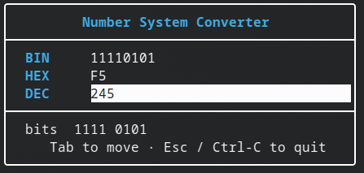

# 🔢 Number System Converter

A snappy terminal UI for converting numbers between **binary**, **hexadecimal**, and **decimal** — live, as you type. Built in modern C++20 with [FTXUI](https://github.com/ArthurSonzogni/FTXUI).




---

## ✨ Features

- **Live two-way conversion** — edit any field and the others update instantly.
- **Input validation** — each field only accepts characters valid for its base (`0/1`, `0-9`, `0-9a-fA-F`).
- **Nibble-grouped bit view** — see the binary layout grouped into 4-bit chunks for readability.
- **Keyboard-driven** — `Tab` to move between fields, `Esc` / `Ctrl-C` to quit.
- **64-bit range** — backed by a single `uint64_t` source of truth.

## 🚀 Quick start

### Build

The build is fully self-contained — CMake fetches FTXUI v7.0.0 for you.

```bash
cmake -S . -B cmake-build-debug
cmake --build cmake-build-debug --target number_system_converter
```

### Run

> ⚠️ **Run it in a real terminal.** FTXUI draws with ANSI escape codes and needs a
> TTY. Inside CLion's *Run* tool window you'll see garbled border fragments — either
> enable **"Emulate terminal in output console"** in the Run Configuration, or just
> run it from a terminal:

```bash
./cmake-build-debug/number_system_converter
```

Type `255` in the DEC field and watch HEX become `FF` and BIN become `11111111`. 🎉

## 🧠 How it works

A single `uint64_t value` is the **source of truth**; each base is just a *view* of it.

```
        ┌─────────────┐   on_change    ┌──────────────┐
  edit ─►│  Input(BIN) │ ─── parse ───► │              │
        └─────────────┘                │  value (u64) │ ─── format ──► other fields
        ┌─────────────┐   on_change    │              │
  edit ─►│  Input(HEX) │ ─── parse ───► │              │
        └─────────────┘                └──────────────┘
```

Editing a field parses it into `value`, then re-renders the *other* fields. A
`syncing` re-entrancy guard prevents the programmatic rewrites from cascading into
an infinite `on_change` loop.

### Project layout

| File          | Responsibility                                                        |
| ------------- | --------------------------------------------------------------------- |
| `convert.hpp` | Pure, UI-free conversion logic — `parseBase`, `toBinary`, `toHex`, `toDecimal`, `groupBits`. Trivially unit-testable. |
| `main.cpp`    | FTXUI component wiring: inputs, validation filters, layout, run loop. |
| `CMakeLists.txt` | Build config; fetches and links FTXUI (`screen` / `dom` / `component`). |

## 🛠️ Built with

- **C++20** (`std::format`, `std::optional`)
- **[FTXUI](https://arthursonzogni.github.io/FTXUI/) v7.0.0** — Functional Terminal (X) User Interface
- **CMake** with `FetchContent`

## 🗺️ Roadmap

- [ ] Octal base
- [ ] Bit-width + signedness selector (8/16/32/64, signed/unsigned)
- [ ] Interactive clickable bit toggling
- [ ] On-screen error feedback for overflow / invalid input
- [ ] Unit tests for `convert.hpp` + CI

## 📄 License

see [License.md](LICENSE) file
