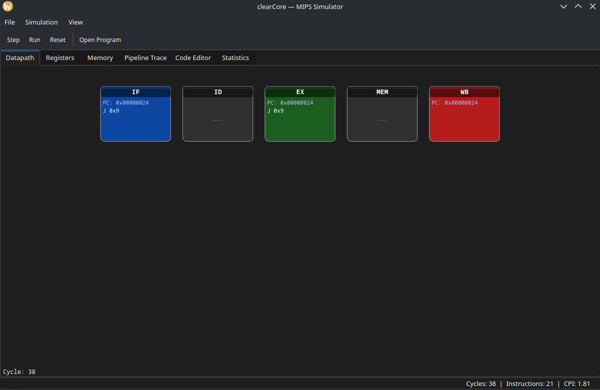
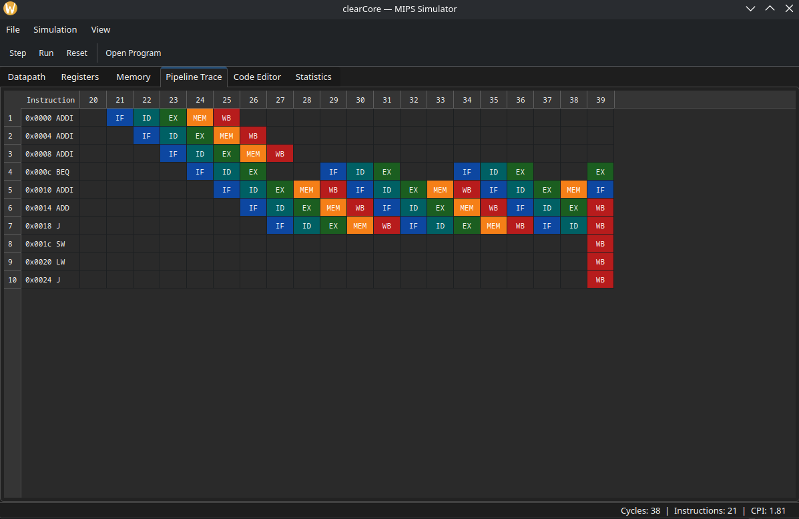
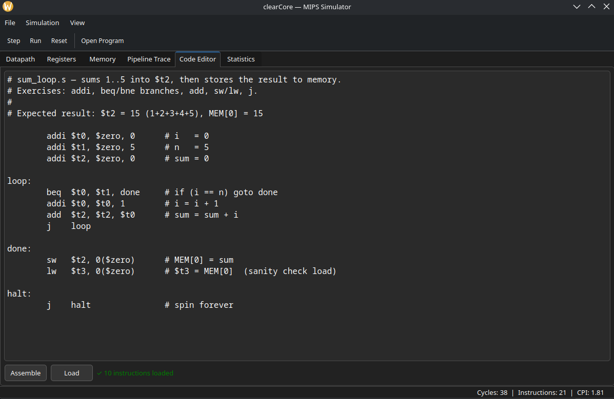
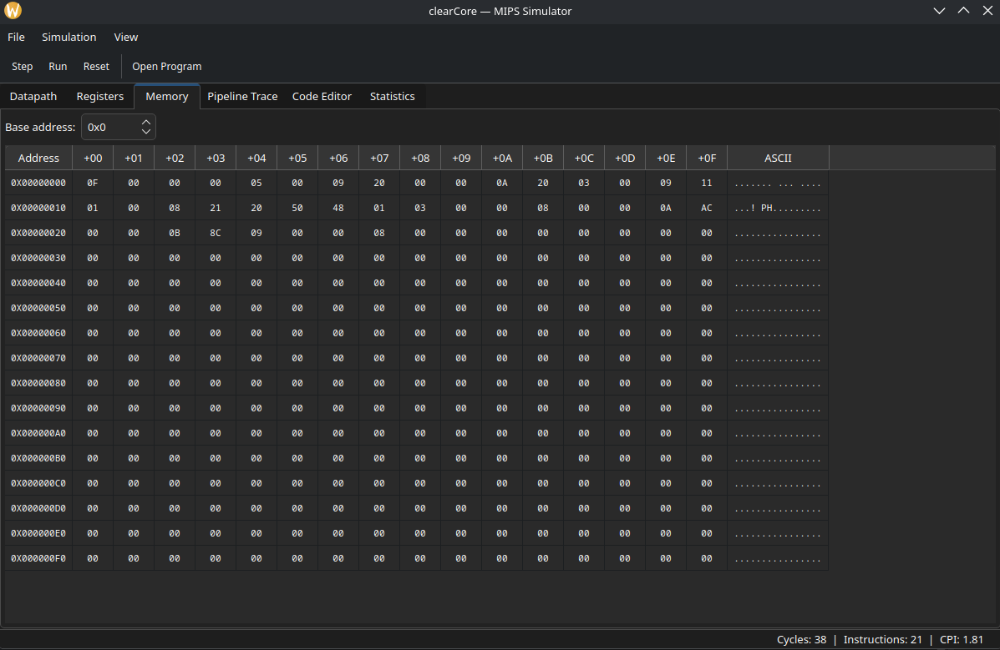
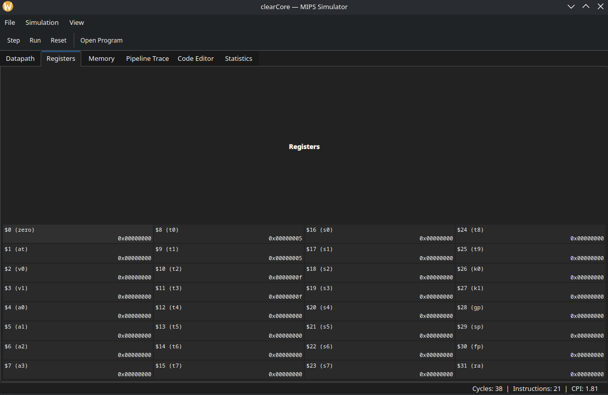
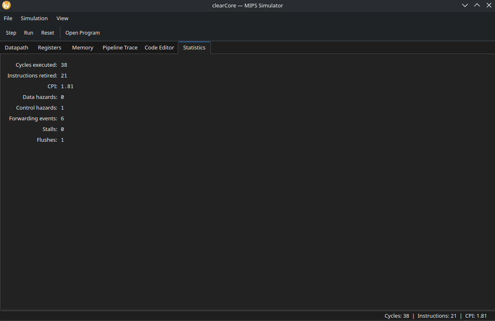
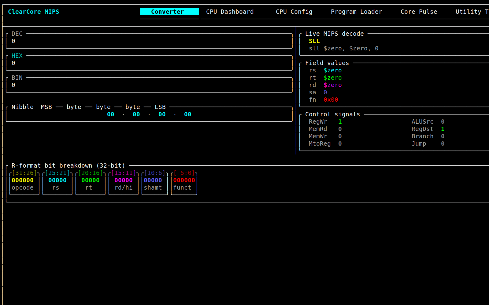
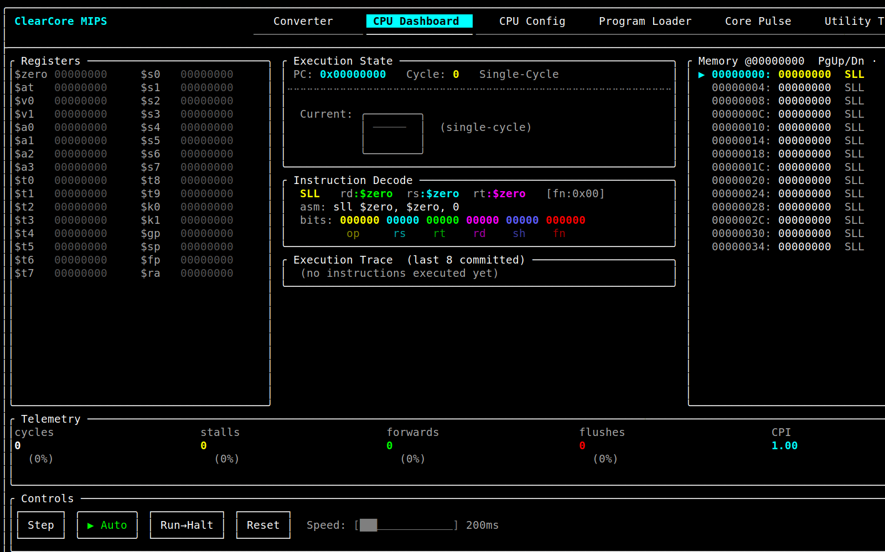
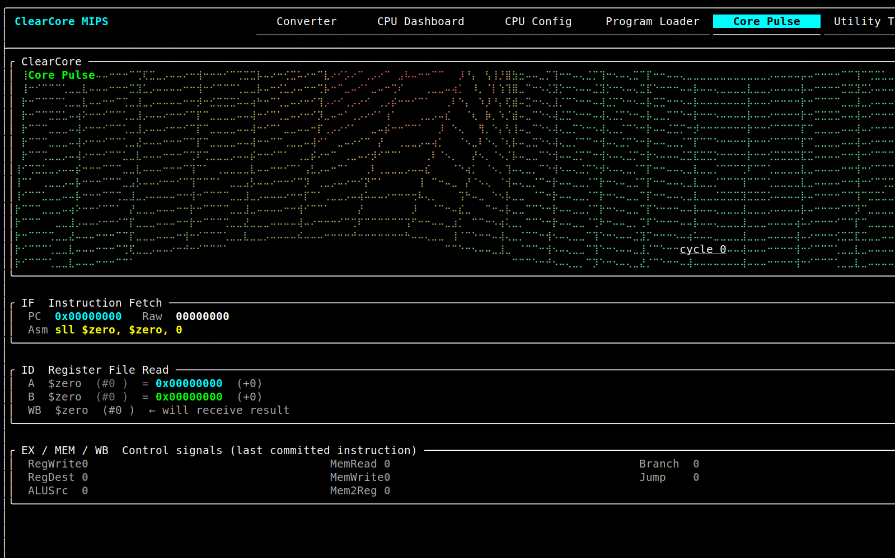
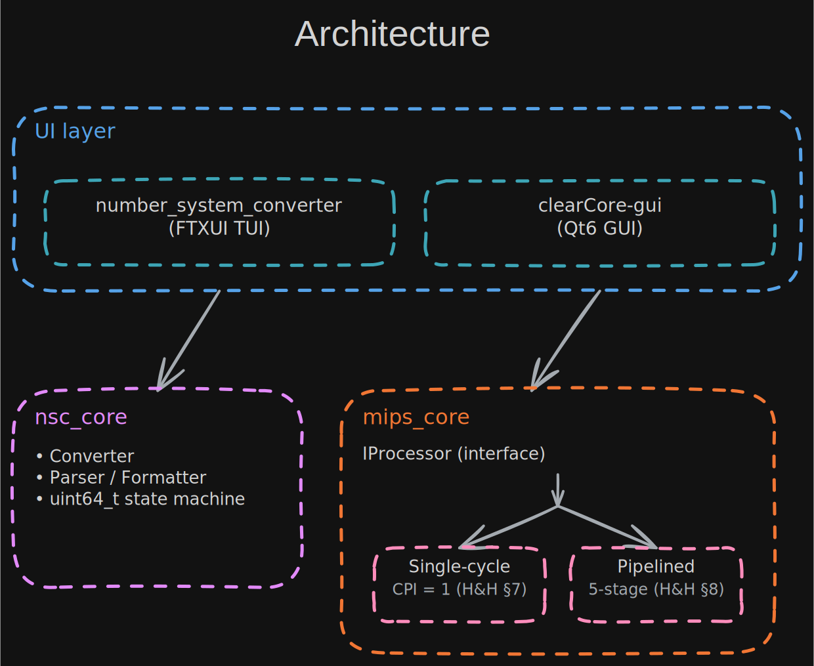

<p align="center">
  
</p>

<h1 align="center">clearCore</h1>

<p align="center">
  Write MIPS assembly, watch it flow through a 5-stage pipeline cycle by cycle,<br>
  and attach real GDB to the running emulator — in your terminal or a Qt6 desktop GUI.<br>
  <b>MIPS today, RISC-V next</b> — on one shared, ISA-agnostic core.
</p>

<p align="center">
  <a href="https://github.com/khenderson20/clearCore/actions/workflows/ci.yml">
    
  </a>
  <a href="https://codecov.io/gh/khenderson20/clearCore">
    
  </a>
  <a href="https://www.bestpractices.dev/projects/13466">
    
  </a>
  <a href="https://scorecard.dev/viewer/?uri=github.com/khenderson20/clearCore">
    
  </a>
  <a href="https://github.com/khenderson20/clearCore/releases/latest">
    
  </a>
  <a href="https://doi.org/10.5281/zenodo.21194876">
    
  </a>
  
  
</p>

<table align="center">
  <tr>
    <td align="center"></td>
    <td align="center"><video src="https://github.com/user-attachments/assets/a56c6fcb-1b09-48f3-8099-97f5f77fe33b" loop autoplay muted controls width="100%"></video></td>
  </tr>
</table>

---

## What is clearCore?

clearCore is a C++20 CPU simulator built for one thing: actually *seeing* how a processor works. You write MIPS assembly, step through it, and watch every instruction travel through the five pipeline stages in real time. Stalls, forwarding paths, and pipeline flushes are all visible as they happen, not hidden away in a debugger output.

When you're ready to go beyond hand-typed programs, you can load a real `mipsel` ELF binary and debug it with actual GDB through the built-in remote stub.

Under the hood there are two execution engines, a single-cycle datapath and a 5-stage pipeline, and you can switch between them at runtime without rebuilding. Three front ends all drive the same core: a keyboard-driven terminal UI, a Qt6 Widgets GUI, and a Qt Quick/QML GUI. The pipeline behavior is identical across all three, so you can pick whichever interface suits you. The design closely follows Harris & Harris (*Digital Design and Computer Architecture*) and Patterson & Hennessy (*Computer Organization and Design*).

**A word on the name.** MIPS stands for *Microprocessor without Interlocked Pipeline Stages*. Real MIPS hardware skipped the pipeline interlocks and left the compiler to schedule around hazards. clearCore brings those interlocks back and lights them up, so you can see every stall, forward, and flush the original silicon hid. And clearCore is not MIPS-only by design. The simulation core was recently split into an ISA-agnostic `isa::` layer with shared memory, register file, pipeline state, and processor interfaces. A **RISC-V (RV32I) backend is next**, and it will reuse all three front ends and every visualizer without modification.

*(clearCore started life as a number-system converter. That converter is still alive as the first tab of the terminal UI.)*

## Download

Prebuilt binaries are attached to every [release](https://github.com/khenderson20/clearCore/releases/latest):

| Platform                          | Asset                                                             | Notes                        |
|-----------------------------------|-------------------------------------------------------------------|------------------------------|
| **Windows**                       | `clearCore-<ver>-windows-x64.exe`                                 | NSIS installer, Qt bundled   |
| **macOS** (Intel + Apple Silicon) | `clearCore-<ver>-macOS-universal.dmg`                             | Universal binary, Qt bundled |
| **Linux**                         | `clearCore-<ver>-Linux-x86_64.tar.gz`, `.AppImage`, `.deb`/`.rpm` | AppImage is self-contained   |

> **These builds are unsigned**, so your OS will warn you on first launch. That is expected and not a problem with the download.
> - **macOS**: Right-click the app, choose **Open**, then **Open** again. Or go to *System Settings → Privacy & Security → Open Anyway*.
> - **Windows**: Click **More info** on the SmartScreen prompt, then **Run anyway**.

Prefer to build it yourself? Read on.

## Quick Start

You need a **C++20 compiler** (GCC 13+ or Clang 16+) and **CMake 3.20+** (3.25+ recommended). The terminal UI pulls in its FTXUI dependency automatically. For the desktop GUIs, install Qt6 first (`qt6-qtbase-devel` on Fedora, `qt6-base-dev` on Ubuntu, `qt@6` via Homebrew). If you do not need Qt at all, the `core-only` preset skips it entirely.

```bash
cmake --preset debug
cmake --build --preset debug

./cmake-build-debug/clearCore-gui              # Qt6 Widgets desktop GUI
./cmake-build-debug/number_system_converter   # terminal UI (needs an ANSI terminal)
./cmake-build-debug/clearCore-quick            # Qt Quick / QML desktop GUI
```

| Preset      | What it builds                                                      |
|-------------|---------------------------------------------------------------------|
| `debug`     | Debug symbols, TUI + Widgets GUI + QML GUI                          |
| `release`   | Optimized release build                                             |
| `asan`      | AddressSanitizer + UBSanitizer (requires `libasan`/`libubsan`)      |
| `core-only` | Simulator core + TUI only, no Qt6 or LLVM                           |

### Your first program

Open `clearCore-gui`, go to the **Code Editor** tab, and load one of the built-in examples or paste this:

```asm
# Each instruction needs the result of the one before it.
addi $t0, $zero, 1
add  $t1, $t0, $t0
add  $t2, $t1, $t0
add  $t3, $t2, $t1
```

Assemble it, switch to the **Datapath** tab, and step through it. You will see the data hazards resolved live as the EX/MEM forwarding paths light up, bypassing results before they ever reach the register file.

### Tests

```bash
ctest --preset debug    # all suites
ctest --preset asan     # same suites under ASan + UBSan
```

Seven core CTest suites cover the decoder, disassembler, ELF loader, CP0, both CPU backends, and the converter core, plus a MARS golden-test suite and a Qt smoke-test suite. When LLVM 15-20 is available, a differential suite validates the disassembler against LLVM's assembler. Every push/PR to `main`/`develop` builds and tests Debug and ASan/UBSan; static analysis, dependency scanning, and fuzzing run under their own trigger conditions. See [Contributing § CI](https://github.com/khenderson20/clearCore/wiki/Contributing#ci-workflows) for exactly which workflow runs when.

## Interfaces

| Interface       | Binary                    | Built with     | Highlights                                                               |
|-----------------|---------------------------|----------------|--------------------------------------------------------------------------|
| **Desktop GUI** | `clearCore-gui`           | Qt6 Widgets    | Dockable panels, code editor with syntax highlighting, hex memory viewer |
| **QML GUI**     | `clearCore-quick`         | Qt Quick / QML | Same tabs, lighter dependency footprint (Qt6 Quick only), newer          |
| **Terminal UI** | `number_system_converter` | FTXUI          | Fully keyboard-driven (`Tab` panels, `F10` step), runs over SSH          |

All three show the same pipeline state, driven by the same `mips_core` library. The Widgets GUI is the most feature-complete today. The QML GUI mirrors its tab structure declaratively, and you can see a comparison on the [Qt6 GUI wiki page](https://github.com/khenderson20/clearCore/wiki/Qt6-GUI). To slim down the build, you can disable either GUI with `-DBUILD_QT6_UI=OFF` or `-DBUILD_QT6_QUICK_UI=OFF`.



<details>
<summary><b>More desktop GUI screenshots</b> — pipeline trace, code editor, memory, registers, statistics</summary>
<br>

**Pipeline Trace** — the classic instruction x cycle grid from Patterson & Hennessy, derived live from the execution trace.



**Code Editor** — assembles MIPS source with labels, branches, and loops directly into the simulator with no external toolchain needed. Optional MIPS syntax highlighting is available when KSyntaxHighlighting is installed (`kf6-syntax-highlighting-devel` on Fedora, `libkf6syntaxhighlighting-dev` on Ubuntu).



**Memory** — a scrollable hex dump at 16 bytes per row with an ASCII column, navigable from any base address.



**Registers** — all 32 MIPS registers with ABI aliases (`$t0`, `$sp`, and so on), updated every cycle.



**Statistics** — cycles, instructions retired, CPI, and per-category counts for hazards, forwarding, stalls, and flushes.



</details>

<details>
<summary><b>Terminal UI screenshots</b> — converter, CPU dashboard, Core Pulse</summary>
<br>

**Converter** — live three-way DEC/HEX/BIN conversion with R-format bit breakdown and control signal decode.



**CPU Dashboard** — registers, instruction decode, execution trace, memory panel, telemetry bar, and step/auto/run controls.



**Core Pulse** — an ambient oscilloscope animation with per-stage IF/ID/EX/MEM/WB instruction and signal breakdown.



Other tabs include **CPU Config** (swap single-cycle and pipelined at runtime), **Program Loader** (flat `.hex` programs), and **Utility** (diagnostics). See the [Terminal UI wiki page](https://github.com/khenderson20/clearCore/wiki/Terminal-UI) for a full walkthrough.

</details>

## Beyond the basics

**CP0 and hardware exceptions.** `mips_core` implements Coprocessor 0 to the MIPS32r2 spec, including `Status`, `Cause`, `EPC`, and `BadVAddr`. Bad opcodes, unaligned accesses, `SYSCALL`, and `BREAK` all raise real exceptions that vector to `0x8000_0180`, the same behavior as physical MIPS hardware.
See the [CP0 & Exceptions wiki](https://github.com/khenderson20/clearCore/wiki/CP0-Exceptions).

**ELF loader.** `mips::load_elf_file_into_processor()` maps a static little-endian MIPS ELF32 binary into the processor's address space exactly the way a kernel exec would. Programs built with `mipsel-linux-gnu-as` or `mipsel-linux-musl-gcc -static` run unmodified.
See the [ELF Loader wiki](https://github.com/khenderson20/clearCore/wiki/ELF-Loader) for toolchain setup instructions.

**GDB remote stub.** Attach real GDB to the running emulator and get breakpoints, single-step, register and memory inspection, and exception-to-signal mapping (`Bp` to SIGTRAP, `RI` to SIGILL, and more):

```bash
mipsel-linux-gnu-gdb hello
(gdb) target remote localhost:1234
(gdb) break _start
(gdb) continue
```

See the [GDB Stub wiki](https://github.com/khenderson20/clearCore/wiki/GDB-Stub) for the full command reference. This feature is POSIX-only and can be disabled with `-DBUILD_GDB_STUB=OFF`.

## Architecture



Two pure-logic core libraries (`mips_core` and `nsc_core`) sit under three UI layers with no UI dependencies of their own, so they can be tested independently. The Qt layers connect CPU state to their views through a shared `SimulatorController`. The TUI talks to the same interfaces directly. For a module-by-module breakdown, design principles, and academic references, see the [Architecture wiki page](https://github.com/khenderson20/clearCore/wiki/Architecture).

### How it compares

|                  | clearCore             | Ripes              | DrMIPS          | EduMIPS64        | QtMips            |
|------------------|-----------------------|--------------------|-----------------|------------------|-------------------|
| **Language**     | C++20                 | C++/Qt             | Java            | Java             | C++/Qt            |
| **UI**           | TUI + Qt6 GUI         | Qt GUI             | Swing GUI       | Swing GUI        | Qt GUI            |
| **ISA**          | MIPS (RISC-V planned) | RISC-V             | MIPS            | MIPS64           | MIPS              |
| **Backends**     | 2 (SC / 5-stage)      | 5+ models          | ~2              | ~1               | ~1                |
| **Pipeline viz** | Stage state + hazards | Datapath schematic | Visual datapath | Registers/memory | Datapath + memory |

## Roadmap

Stages 1 through 2.6 are complete, covering the converter core, pipelined CPU, Qt6 GUIs, CP0, ELF loading, and GDB support. The most recent work split the simulator into an ISA-agnostic core, which opens the door for a second instruction set. Here is what is coming next:

- [ ] **RISC-V (RV32I)** — a second ISA backend on the shared `isa::` core: decoder, single-cycle, 5-stage pipeline, ELF, and GDB, reusing every existing front end and visualizer
- [ ] **Stage 3** — a two-pass assembler with a full symbol table and pseudo-instruction expansion
- [ ] **Stage 4** — per-stage TUI telemetry and CPI analysis, matching the GUI's Pipeline Trace and Statistics tabs
- [ ] **Stage 5** — branch prediction and speculative execution

See the [Roadmap wiki page](https://github.com/khenderson20/clearCore/wiki/Roadmap) for the full breakdown.

## Documentation

| Doc                                                                                 | Audience                                                       |
|-------------------------------------------------------------------------------------|----------------------------------------------------------------|
| [Getting Started](https://github.com/khenderson20/clearCore/wiki/Getting-Started)   | Beginners learning MIPS concepts through the TUI visualization |
| [Architecture](https://github.com/khenderson20/clearCore/wiki/Architecture)         | Design patterns, hardware abstractions, and academic grounding |
| [CP0 and Exceptions](https://github.com/khenderson20/clearCore/wiki/CP0-Exceptions) | MIPS32r2 exception model, CP0 registers, ERET, MFC0/MTC0       |
| [ELF Loader](https://github.com/khenderson20/clearCore/wiki/ELF-Loader)             | Loading compiled mipsel binaries and toolchain setup           |
| [GDB Stub](https://github.com/khenderson20/clearCore/wiki/GDB-Stub)                 | GDB RSP server, breakpoints, single-step, exception signals    |
| [Qt6 GUI](https://github.com/khenderson20/clearCore/wiki/Qt6-GUI)                   | How `nsc_qt` and `SimulatorController` are structured          |
| [Contributing](https://github.com/khenderson20/clearCore/wiki/Contributing)         | Branching model, code style, and testing guidelines            |
| [Roadmap](https://github.com/khenderson20/clearCore/wiki/Roadmap)                   | Staged feature plan and reference patterns                     |

## Citation

If you use clearCore in research or teaching, please cite it. Each release is archived on Zenodo with a DOI:

[](https://doi.org/10.5281/zenodo.21194876)

GitHub's **"Cite this repository"** button in the top-right sidebar generates APA and BibTeX from [`CITATION.cff`](CITATION.cff). For convenience:

```bibtex
@software{henderson_clearcore,
  author  = {Henderson, Kevin},
  title   = {{clearCore}: An educational {CPU}-architecture simulator with live 5-stage pipeline visualization},
  year    = {2026},
  version = {0.1.0},
  doi     = {10.5281/zenodo.21194876},
  url     = {https://github.com/khenderson20/clearCore}
}
```

> The DOI above is the *concept* DOI, which always resolves to the latest release. Zenodo also mints a version-specific DOI for each release if you need to cite an exact version.

## License

MIT — see [LICENSE](LICENSE).
