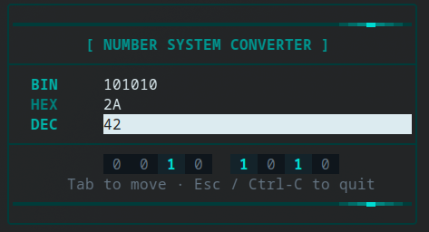
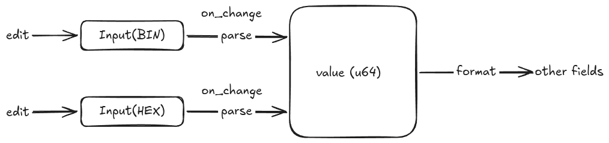

# 🔢 Number System Converter

A snappy terminal UI for converting numbers between **binary**, **hexadecimal**, and **decimal** — live, as you type. Built in modern C++20 with [FTXUI](https://github.com/ArthurSonzogni/FTXUI).





## ✨ Features

- **Live two-way conversion** — edit any field and the others update instantly.
- **Input validation** — each field only accepts characters valid for its base (`0`/`1`, `0`-`9`, `0`-`9a`‑`fA`‑`F`).
- **Nibble-grouped bit view** — see the binary layout grouped into 4-bit chunks for readability.
- **Keyboard-driven** — `Tab` to move between fields, `Esc`/`Ctrl`-`C` to quit.
- **64-bit range** — backed by a single `uint64_t` source of truth.

## 🚀 Quick start

### Build

The build is fully self-contained — CMake fetches FTXUI v7.0.0 for you.

```bash
cmake -S . -B cmake-build-debug
cmake --build cmake-build-debug --target number_system_converter
```

### Run

> ⚠️ **Run it in a real terminal.** FTXUI draws with ANSI escape codes and needs a
> TTY. Inside CLion's *Run* tool window you'll see garbled border fragments — either
> enable **"Emulate terminal in output console"** in the Run Configuration, or just
> run it from a terminal:

```bash
./cmake-build-debug/number_system_converter
```

Type `255` in the DEC field and watch HEX become `FF` and BIN become `11111111`. 🎉

## 🧠 How it works

A single `uint64_t value` is the **source of truth**; each base is just a *view* of it.



Editing a field parses it into `value`, then re-renders the *other* fields. A
`syncing` re-entrancy guard prevents the programmatic rewrites from cascading into
an infinite `on_change` loop.

### Project layout — Three Pillars of nsc_core

The core logic is split for testability: `nsc_core` contains no UI code and can be verified independently with `convert_test`. The frontend (`nsc_ui`) depends on the core but knows nothing about FTXUI's internal rendering.

| Module       | Responsibility                                                                                       |
| ------------ | --------------------------------------------------------------------------------------------- |
| **converter**  | Orchestrator: manages conversion between bases, provides `as()` views and bit grouping. |
| **parse**      | String-to-uint64 parser with base support; validates inputs before committing to state.       |
| **format**    | Serializer for binary (expand on zero), hex (`%X`), decimal, and nibble groups.            |

## 🛠️ Built with

- **C++20**: Leveraging `std::format`, `std::optional`, and C++17/20 string views
- **FTXUI v7.0.0**: For the reactive UI layer (screen, dom, component)
- **CMake FetchContent**: Declarative dependency fetching

## 🗺️ Roadmap

- [ ] Octal base support
- [ ] Bit-width and signedness selection (8/16/32/64 bits)
- [ ] Interactive bit toggling in the grid view
- [ ] On-screen error feedback for overflow or malformed strings
- [ ] CI pipeline with automatic conversion tests

## 📄 License

see [License.md](LICENSE) file
