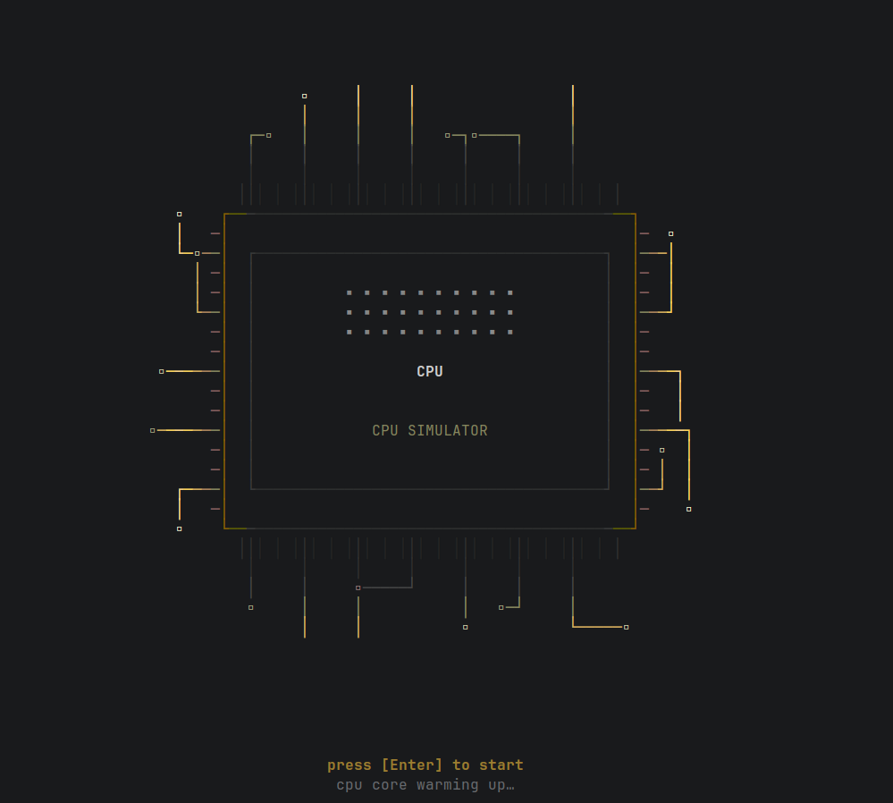

<p align="center">
  
</p>

<h1 align="center">clearCore</h1>

<p align="center">
  A C++20 MIPS CPU simulator with interchangeable single-cycle and 5-stage pipelined datapaths,<br>
  available as both a keyboard-driven terminal UI and a native Qt6 desktop GUI.
</p>

<p align="center">
  <a href="https://github.com/khenderson20/clearCore/actions/workflows/ci.yml">
    
  </a>
  <a href="https://codecov.io/gh/khenderson20/clearCore">
    
  </a>
  <a href="https://www.bestpractices.dev/projects/13466">
    
  </a>
  <a href="https://scorecard.dev/viewer/?uri=github.com/khenderson20/clearCore">
    
  </a>
</p>

<p align="center">
  
  
  
  
  
  
</p>

<p align="center">
  
</p>

---

- [Overview](#overview)
- [Qt6 Desktop GUI](#qt6-desktop-gui)
- [Terminal UI](#terminal-ui)
- [Quick Start](#quick-start)
- [Architecture](#architecture)
- [Ecosystem](#ecosystem)
- [Roadmap](#roadmap)
- [Documentation](#documentation)
- [License](#license)

---

## Overview

clearCore started as a live number system converter — accepting values in decimal, binary, or hexadecimal and
propagating changes across all three representations simultaneously — and grew into a full MIPS CPU simulator. Both
front ends drive the same `mips_core` and `nsc_core` libraries, so every feature (pipeline state, hazard resolution,
telemetry) behaves identically regardless of which UI you run.

The processor model follows the **Ripes/DrMIPS pluggable-backend pattern**: the abstract `IProcessor` interface
decouples execution engines from rendering. `SingleCycleCpu` and `PipelinedCpu` swap in and out at runtime — no rebuild,
no UI change required. Both expose the same `PipelineState`, so IF/ID/EX/MEM/WB render identically across the TUI and
the Qt6 GUI.

Reference texts: **Harris & Harris** *Digital Design and Computer Architecture* (single-cycle datapath, control signal
generation) and **Patterson & Hennessy** *Computer Organization and Design* (pipelining, hazards, forwarding).

---

## Qt6 Desktop GUI

The GUI provides a tabbed interface with a cycle-accurate pipeline datapath view, an integrated MIPS assembler and code
editor, and a hex memory inspector — all driven by the same `mips_core` and `nsc_core` libraries as the terminal UI.

<table>
<tr>
<td width="50%">

**Datapath** — the 5-stage pipeline rendered cycle-by-cycle. Double-click a stage to inspect the instruction inside it;
right-click to set or clear a breakpoint.


</td>
<td width="50%">

**Pipeline Trace** — the classic instruction × cycle grid from Patterson & Hennessy, derived automatically from the
program's execution trace.


</td>
</tr>
<tr>
<td width="50%">

**Code Editor** — accepts MIPS assembly source with labels, branches, and loops; assembles and loads directly into the
simulator. No external toolchain required.


</td>
<td width="50%">

**Memory** — scrollable hex dump (16 bytes/row with ASCII column), navigable from any base address.


</td>
</tr>
<tr>
<td width="50%">

**Registers** — all 32 MIPS registers with ABI aliases (`$t0`, `$sp`, …), updated every cycle.


</td>
<td width="50%">

**Statistics** — cycles executed, instructions retired, CPI, and per-category hazard, forwarding, stall, and flush
counts.


</td>
</tr>
</table>

### Building the GUI

```bash
# Install Qt6
sudo dnf install qt6-qtbase-devel qt6-qtbase-gui   # Fedora / RHEL
sudo apt install qt6-base-dev                       # Ubuntu / Debian
brew install qt@6                                   # macOS

cmake -S . -B cmake-build-debug
cmake --build cmake-build-debug --target clearCore-gui
./cmake-build-debug/clearCore-gui
```

> `BUILD_QT6_UI` defaults to `ON`. To build the TUI only, add `-DBUILD_QT6_UI=OFF` to the configure step.

---

## Terminal UI

Fully keyboard-driven — `Tab` moves between panels, `F10` steps the CPU, `Esc` quits. Runs in any ANSI terminal.

<table>
<tr>
<td width="50%">

**Splash screen** — animated CPU circuit on startup.



</td>
<td width="50%">

**Converter** — live three-way number conversion with R-format bit breakdown, field decode, and control signal display.


</td>
</tr>
<tr>
<td width="50%">

**CPU Dashboard** — registers, instruction decode, execution trace, memory panel, telemetry bar, and step/auto/run
controls.


</td>
<td width="50%">

**Core Pulse** — ambient oscilloscope animation with per-stage IF/ID/EX/MEM/WB instruction and signal breakdown.


</td>
</tr>
</table>

| Tab                | Purpose                                                                               |
|--------------------|---------------------------------------------------------------------------------------|
| **Converter**      | Live binary/hex/decimal conversion + R-format bit breakdown and control signal decode |
| **CPU Dashboard**  | Registers, pipeline stages, hazard badges, instruction trace, memory, telemetry       |
| **CPU Config**     | Toggle between single-cycle and 5-stage pipelined backends at runtime                 |
| **Program Loader** | Load a flat `.hex` program (one 32-bit word per line) into memory                     |
| **Core Pulse**     | Oscilloscope animation + per-stage IF/ID/EX/MEM/WB instruction and signal panel       |
| **Utility**        | Developer tools and diagnostics                                                       |

---

## Quick Start

### Prerequisites

- **C++20 compiler** — GCC 13+ or Clang 16+
- **CMake 3.25+**
- **Qt6** for the desktop GUI (optional — omit with `-DBUILD_QT6_UI=OFF`)

FTXUI v7.0.0 is fetched automatically via CMake FetchContent — no system install required.

### Build

The recommended path uses CMake presets:

```bash
cmake --preset debug
cmake --build --preset debug
```

Manual configure works too:

```bash
cmake -S . -B cmake-build-debug
cmake --build cmake-build-debug
```

Available presets:

| Preset      | What it builds                                                 |
|-------------|----------------------------------------------------------------|
| `debug`     | Debug symbols, TUI + GUI                                       |
| `release`   | Optimized release build                                        |
| `asan`      | AddressSanitizer + UBSanitizer (requires `libasan`/`libubsan`) |
| `core-only` | Simulator core + TUI only — skips Qt6 and LLVM entirely        |

### Run

```bash
# Terminal UI
./cmake-build-debug/number_system_converter

# Qt6 desktop GUI
./cmake-build-debug/clearCore-gui
```

> **Terminal note:** FTXUI requires an ANSI-capable terminal. If running from an IDE, enable *Emulate terminal in output
console* or launch from the shell.

### Test

Five CTest suites cover the decoder, disassembler, program loader, both CPU backends via the shared `IProcessor`
contract harness, and the converter core. The GUI adds a smoke-test suite (`qt_ui_test`) when `BUILD_QT6_UI=ON`.

```bash
ctest --preset debug    # run all suites
ctest --preset asan     # same suites under AddressSanitizer + UBSan
```

CI (GitHub Actions) runs core suites in Debug and ASan/UBSan configurations on every push and pull request.
Static-analysis config lives in `.clang-tidy`; code style in `.clang-format`.

---

## Architecture

The system is structured as two independent core libraries and two UI layers, linked via CMake:


`nsc_qt` (the Qt6 layer) owns a `SimulatorController` that wraps an `IProcessor` and re-emits its state as Qt signals
for the tab widgets to render. The TUI's `nsc_ui` layer talks to the same interfaces directly.

### Module Reference

| Module                 | Library     | Responsibility                                                                          |
|------------------------|-------------|-----------------------------------------------------------------------------------------|
| `Converter`            | `nsc_core`  | `uint64_t` state, base-N views                                                          |
| `Parser` / `Formatter` | `nsc_core`  | String validation and serialization                                                     |
| `IProcessor`           | `mips_core` | Abstract contract for all execution engines                                             |
| `SingleCycleCpu`       | `mips_core` | Non-pipelined datapath — CPI = 1 (H&H §7)                                               |
| `PipelinedCpu`         | `mips_core` | 5-stage pipeline with load-use stalls, EX/MEM→EX forwarding, branch/jump flush (H&H §8) |
| `Decoder` / `ALU`      | `mips_core` | Format detection, control signal generation, arithmetic                                 |
| `SimulatorController`  | `nsc_qt`    | Owns an `IProcessor`; re-emits its state as Qt signals                                  |
| In-app assembler       | `nsc_qt`    | Parses MIPS assembly with labels into instruction words                                 |

### Design Conventions

- `mips_core` and `nsc_core` contain pure logic with no UI dependency — tested independently.
- Polymorphism via `IProcessor` keeps backends swappable at runtime.
- `enum class` for all hardware fields; `[[nodiscard]]` on all pure queries.
- C++20 throughout: `std::format`, `std::optional`, ranges.

---

## Ecosystem

clearCore applies the Ripes pluggable-backend pattern to the MIPS ISA. It is distinct among this set in providing both a
terminal UI and a native desktop GUI over a shared simulation core.

|                  | clearCore             | Ripes              | DrMIPS          | EduMIPS64        | QtMips            |
|------------------|-----------------------|--------------------|-----------------|------------------|-------------------|
| **Language**     | C++20                 | C++/Qt             | Java            | Java             | C++/Qt            |
| **UI**           | TUI + Qt6 GUI         | Qt GUI             | Swing GUI       | Swing GUI        | Qt GUI            |
| **ISA**          | MIPS                  | RISC-V             | MIPS            | MIPS64           | MIPS              |
| **Backends**     | 2 (SC / 5-stage)      | 5+ models          | ~2              | ~1               | ~1                |
| **Pipeline viz** | Stage state + hazards | Datapath schematic | Visual datapath | Registers/memory | Datapath + memory |

---

## Roadmap

- [x] **Stage 1** — Number converter core + MIPS decoder
- [x] **Stage 1.5** — `IProcessor` refactor; single-cycle and pipelined backends
- [x] **Stage 2** — TUI execution visualizer: memory panel, hazard badges, speed controls, telemetry
- [x] **Stage 2.5** — Qt6 GUI: datapath, registers, memory, pipeline trace, code editor with in-app assembler,
  statistics
- [ ] **Stage 3** — Two-pass assembler with full symbol table, label resolution, and pseudo-instruction expansion *(the
  Qt6 Code Editor covers labels and branches; pseudo-instructions are still outstanding)*
- [ ] **Stage 4** — Per-stage TUI telemetry and CPI analysis to reach parity with the GUI's Pipeline Trace and
  Statistics tabs
- [ ] **Stage 5** — Branch prediction and speculative execution

See [docs/ROADMAP.md](docs/ROADMAP.md) for the full breakdown.

---

## Documentation

| Doc                                                   | Audience                                                       |
|-------------------------------------------------------|----------------------------------------------------------------|
| [USER_GUIDE.md](docs/USER_GUIDE.md)                   | Beginners learning MIPS concepts through the TUI visualization |
| [ARCHITECTURE_DESIGN.md](docs/ARCHITECTURE_DESIGN.md) | Design patterns, hardware abstractions, and academic grounding |
| [QT6_ARCHITECTURE.md](docs/QT6_ARCHITECTURE.md)       | How `nsc_qt` and `SimulatorController` are structured          |
| [CONTRIBUTING.md](docs/CONTRIBUTING.md)               | Branching model, code style, and testing guidelines            |
| [ROADMAP.md](docs/ROADMAP.md)                         | Staged feature plan and reference patterns                     |

---

## License

MIT — see [LICENSE](LICENSE).
