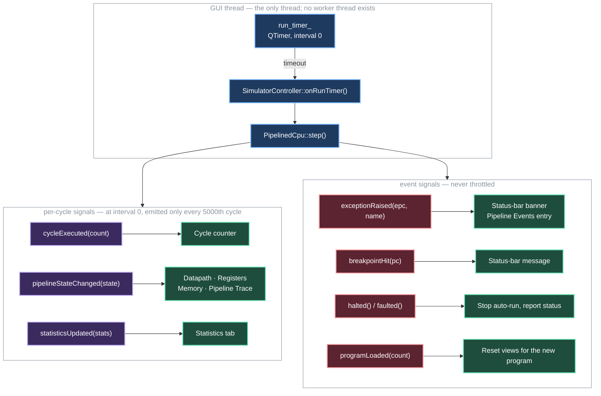

# Qt6 GUI

The desktop interface (`clearCore-gui`) is built with Qt6 Widgets, plus two vendored UI libraries fetched via CMake: [Qt-Advanced-Docking-System](https://github.com/githubuser0xFFFF/Qt-Advanced-Docking-System) for the dockable panel layout and [QHexView](https://github.com/Dax89/QHexView) for the Memory tab's hex viewer. It shares no UI code with the FTXUI terminal UI — both compile from the same `mips_core` and `nsc_core` libraries.

A second, parallel desktop interface — `clearCore-quick`, built on Qt Quick/QML — also exists; see [QML (nsc_quick)](#qml-nsc_quick) below.

---

## Launch

```bash
cmake --build cmake-build-debug --target clearCore-gui
./cmake-build-debug/clearCore-gui
```

Qt6 must be installed on the system (see [Getting Started](Getting-Started)). If Qt6 isn't found at configure time, this target is silently skipped and the rest of the build still succeeds.

---

## Six tabbed views

### Datapath

A clickable diagram of the 5-stage MIPS pipeline. Each stage box (IF, ID, EX, MEM, WB) is clickable — clicking (or pressing **Space**/**B** on the selected stage) highlights that stage and shows its current pipeline register contents in a side panel. Right-click a stage to set or clear a **breakpoint** on its PC; execution pauses and the status bar reports the hit address.

Color coding follows the same convention as the TUI: green for normal advance, yellow for stall bubbles, red for flush, cyan when a forwarding path is active.

### Registers

All 32 MIPS registers in a scrollable table: register number, ABI name (`$zero`, `$at`, `$v0`, …, `$ra`), hex value, and signed-decimal value. The row for the most recently written register is highlighted in the same color as the Datapath's WB stage.

### Memory

A scrollable hex dump (QHexView-backed) of the address space, 16 bytes/row with an ASCII column, navigable from any base address. The row containing the current PC is highlighted.

### Pipeline Trace

An instruction × cycle grid (the classic Patterson & Hennessy layout, also seen in WebRISC-V): rows are instructions in program order, columns are clock cycles, and each cell shows which pipeline stage that instruction occupied during that cycle. Stall bubbles and flush events are color-coded. This view accumulates during a run and resets when the CPU resets.

### Code Editor

An inline MIPS assembler. Write assembly text in the left pane; the right pane shows the assembled instruction words. Features:

- Label definitions (`loop:`) and label references in branch/jump targets
- Forward and backward branch resolution
- Line-numbered syntax error reporting
- **Assemble & Load** — assembles and transfers the program to the CPU in one click
- **Optional MIPS syntax highlighting** via [KSyntaxHighlighting](https://invent.kde.org/frameworks/syntax-highlighting) (KDE framework, MIT since KF 5.50) — when the system package is found at configure time, the editor attaches Kate's MIPS Assembler definition (GNU Assembler fallback) and tracks the application light/dark theme preference automatically. Without the package, the editor behaves as before (plain text, no change to any other behavior).

The supported instruction set matches the decoder's ISA subset (see [MIPS CPU Simulator](MIPS-CPU-Emulator#supported-isa-subset)). Pseudo-instructions (`li`, `move`, `la`) and assembler directives (`.data`/`.text`/`.word`) are **not** supported yet — that's the remaining Stage 3 scope; see [Roadmap](Roadmap).

### Statistics

A post-run summary dashboard: total cycles, committed instructions, CPI, and stall / forward / flush counts, with a proportional hazard-type breakdown bar.

---

## Architecture: `SimulatorController`

The simulation runs **on the GUI thread**, driven by a zero-interval `QTimer` rather than a worker thread. `SimulatorController` mediates between the CPU and the widgets:



`SimulatorController` (`include/nsc_qt/simulator_controller.h`) has no separate `registersChanged`/`memoryChanged`/`traceRowAdded` signals — the Registers, Memory, and Pipeline Trace tabs all derive their view from the single `pipelineStateChanged(mips::PipelineState)` payload rather than getting dedicated signals of their own.

Because every connection is within one thread, these are direct calls — nothing is queued or marshalled across a thread boundary. `SimulatorController` does hold a `QMutex`, but in this application it is uncontended; see [`src/nsc_qt/docs/SimulatorController.md`](https://github.com/khenderson20/clearCore/blob/main/src/nsc_qt/docs/SimulatorController.md) for the detailed account.

### Concurrency rules

- **There is no worker thread.** Stepping happens inside a `QTimer` slot on the GUI thread, so a long
  run does not block the UI only because `run_timer_` uses interval 0 and yields to the event loop
  between cycles. Anything that blocks inside `step()` freezes the window.
- Per-cycle signals are throttled at maximum speed (`cycle % 5000`) to stop the event queue flooding;
  a manual `stepCycle()` always emits, or the UI would show stale state.
- Signal parameters are passed **by value** (`mips::PipelineState`, `SimulatorStatistics`). That is not
  currently a thread-boundary requirement — it is what would make moving the CPU onto a real worker
  thread a contained change.
- Widgets read the state carried in the signal payload. They must not call `IProcessor` methods
  directly, so that the controller stays the single point of access if threading is ever introduced.

---

## Build notes

CMakeLists.txt compiles the TUI and both GUI targets by default (`BUILD_QT6_UI` and `BUILD_QT6_QUICK_UI` both default `ON`). Building only the Widgets GUI:

```bash
cmake --build cmake-build-debug --target clearCore-gui
```

New `.cpp` or `.h` files added to `nsc_qt/` must be registered in `CMakeLists.txt` — Qt's MOC (meta-object compiler) will not pick them up automatically and you will get a linker error, not a compile error.

### KSyntaxHighlighting (optional)

KSyntaxHighlighting is detected automatically at configure time — no CMake flag is needed. To install it:

```bash
# Fedora / RHEL
sudo dnf install kf6-syntax-highlighting-devel

# Ubuntu 25.10+
sudo apt install libkf6syntaxhighlighting-dev
```

If the package is absent, CMake prints `KSyntaxHighlighting not found: Code Editor stays plain text` and the build proceeds unaffected.

---

## QML (`nsc_quick`)

`src/nsc_quick` and `qml/ClearCore` contain a second, Qt Quick/QML-based interface (`clearCore-quick`) that targets the same `mips_core` backend, built by default alongside the Widgets GUI. Its QML components (`Main.qml`, `DatapathStrip.qml`, `RegistersPane.qml`, `MemoryPane.qml`, `TracePane.qml`, `StatsPane.qml`, `EditorPane.qml`, plus shared `Theme.qml`, `CCButton.qml`, `TransportBar.qml`, `StatusPill.qml`, `HazardBadge.qml`, `StageCard.qml`) mirror the Widgets GUI's tab structure. It reuses the same `assembler.h`/`.cpp` and `examples.h`/`.cpp` from `nsc_qt` rather than duplicating them.

```bash
cmake --build cmake-build-debug --target clearCore-quick
./cmake-build-debug/clearCore-quick
```

Treat it as available but less battle-tested than the Widgets GUI. To skip it without skipping the Widgets GUI, add `-DBUILD_QT6_QUICK_UI=OFF` at configure time.

### Widgets vs. QML — what's different

| | Qt6 Widgets (`clearCore-gui`) | Qt Quick / QML (`clearCore-quick`) |
|---|---|---|
| **UI language** | C++ (`QWidget` subclasses) | Declarative QML with reactive property bindings |
| **Panel layout** | Dockable, resizable panels via Qt-Advanced-Docking-System | Fixed tab layout |
| **Memory viewer** | QHexView hex dump widget | Custom QML `MemoryPane` |
| **Syntax highlighting** | Optional KSyntaxHighlighting (MIPS/Kate grammar) | Not yet wired |
| **Assembler** | `assembler.h`/`.cpp` in `nsc_qt` | Shared — `nsc_quick` reuses `nsc_qt`'s assembler directly |
| **Dependencies** | Qt6 Widgets + QADS + QHexView | Qt6 Quick only |
| **Maturity** | Feature-complete, battle-tested | Available, less battle-tested |

Both UIs hold an `IProcessor*` and are driven by the same `SimulatorController` signal/slot bridge, so pipeline state, hazard resolution, and telemetry behave identically in both.
